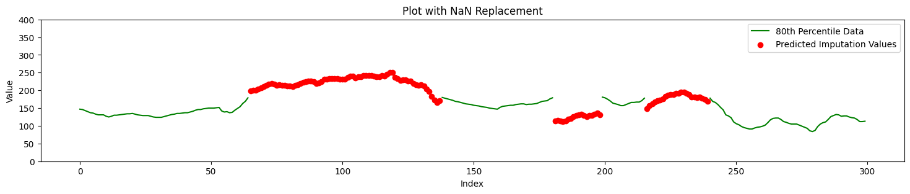

# 2024_DIABETES_PROJECT
Course Project 6: Imputation Model for Glucose Values Out of Measuring Range for Continuous Glucose Monitors 

Linear Regression imputation.
Window size = 300 with random window splitting around each missing value.

